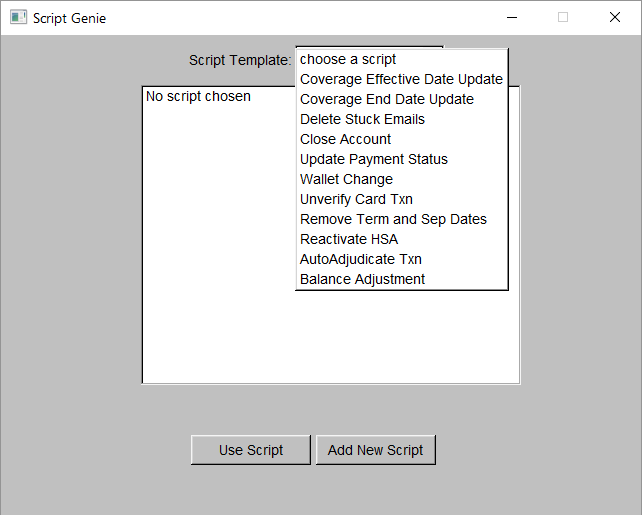
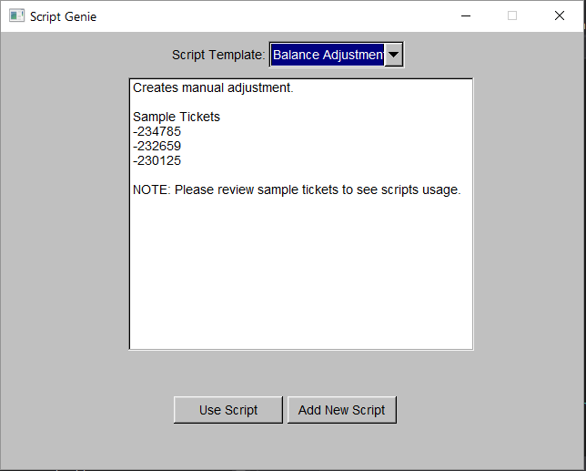
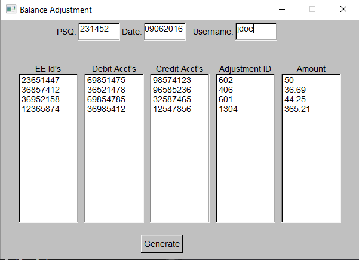
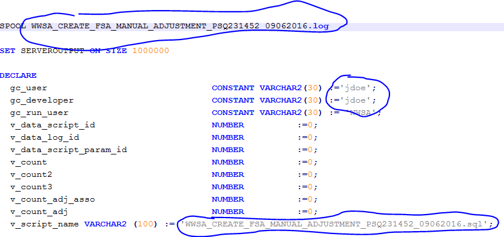
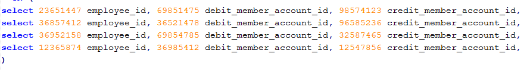

# Script-Genie-1.0
A program that generates pl/sql scripts based on template selected and parameters passed in.

User selects the script template they want to use

General script information is provided.

User fills in the text boxes with information and clicks generate

PL/SQL script is generated with given info

